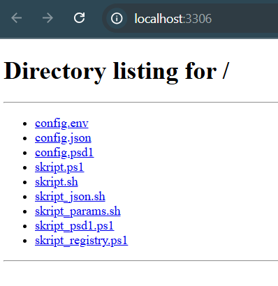

# **LB2: Konfigurationsdaten auslagern – Dokumentation**  
**Von Nicolas Manser**

## **Inhaltsverzeichnis**
1. [Übersicht](#übersicht)  
2. [Möglichkeiten zur Auslagerung von Konfigurationsdaten](#möglichkeiten-zur-auslagerung-von-konfigurationsdaten)
3. [Voraussetzungen](#voraussetzungen)  
4. [Praktische Beispiele](#praktische-beispiele)  
   - [Bash (Linux)](#bash-linux)  
   - [PowerShell (Windows)](#powershell-windows)  
5. [Vergleich der Methoden](#vergleich-der-methoden)  
6. [Screenshots der Ausführung](#screenshots-der-ausführung)
7. [Bekannte Probleme](#bekannte-probleme) 
8. [Reflexion](#reflexion)  
9. [Quellcode & Dateien](#quellcode--dateien)  

---

## **Übersicht**  
In dieser LB2 geht es darum, Konfigurationsdaten (wie IP-Adressen, URLs oder Ports) aus Skripten auszulagern, damit sie nicht direkt im Code stehen.  
Das Ziel ist es, verschiedene Methoden zu vergleichen, wie man diese Daten extern speichern und in Skripten einlesen kann.  
Untersucht wurden **Bash (Linux)** und **PowerShell (Windows)**.

---

## **Möglichkeiten zur Auslagerung von Konfigurationsdaten**

Folgende Methoden wurden untersucht:

- **Umgebungsvariablen** (z. B. in Bash: `export DB_HOST=localhost`)  
- **Externe Dateien** wie `.env`, `.json`, `.ini`, `.psd1`  
- **Kommandozeilenparameter** (z. B. `./skript.sh --port 3306`)  
- **Registry** (nur für Windows/PowerShell relevant)

---

## Voraussetzungen  
### Bash (Git Bash/WSL)  
- **jq installieren** (nur für JSON):  
  ```bash  
  # Linux/WSL:  
  sudo apt install jq  

  # Windows (mit Chocolatey):  
  choco install jq -y  
---

## **Praktische Beispiele**

## Bash (Linux)

### 1. skript.sh

```bash
#!/bin/bash
if [ ! -f "config.env" ]; then
    echo "Fehler: config.env nicht gefunden!"
    exit 1
fi
source config.env
echo "Datenbank: $DB_HOST:$DB_PORT"
```

Funktion:  
Überprüft, ob config.env existiert. Lädt Umgebungsvariablen und gibt die Datenbank-Info aus.

### 2. skript_json.sh

```bash
#!/bin/bash
if ! command -v jq &> /dev/null; then
    echo "Fehler: jq ist nicht installiert. Nutze PowerShell für JSON."
    exit 1
fi

HOST=$(jq -r '.database.host' config.json)
PORT=$(jq -r '.database.port' config.json)
echo "Datenbank: $HOST:$PORT"
```

Funktion:  
Liest config.json mit jq. Falls jq fehlt (häufig unter Windows), erfolgt ein Hinweis zur Nutzung von PowerShell.

### 3. skript_params.sh

```bash
#!/bin/bash
HOST="localhost"
PORT="3306"

while [[ "$#" -gt 0 ]]; do
    case $1 in
        --host) HOST="$2"; shift ;;
        --port) PORT="$2"; shift ;;
        *) echo "Unbekannter Parameter: $1"; exit 1 ;;
    esac
    shift
done

echo "Datenbank: $HOST:$PORT"
```

Funktion:  
Nimmt --host und --port als Parameter entgegen. Gibt die konfigurierten Werte aus.

## PowerShell (Windows)

### 1. skript.ps1

```powershell
if (-not (Test-Path "config.json")) {
    Write-Host "Fehler: config.json nicht gefunden!"
    exit 1
}

$config = Get-Content config.json | ConvertFrom-Json
$url = "http://$($config.database.host):$($config.database.port)"

Write-Host "Starte Browser mit: $url"
Start-Process "chrome.exe" $url

Write-Host "Starte Test-Webserver auf Port $($config.database.port)..."
python -m http.server $config.database.port
```

Funktion:  
Lädt config.json, öffnet Chrome mit URL, startet Python-Webserver auf dem angegebenen Port.

### 2. skript_psd1.ps1

```powershell
if (-not (Test-Path "config.psd1")) {
    Write-Host "Fehler: config.psd1 nicht gefunden!"
    exit 1
}

$config = Import-PowerShellDataFile config.psd1
$url = "http://$($config.db.host):$($config.db.port)"

Write-Host "Starte Browser mit: $url"
Start-Process "chrome.exe" $url

Test-NetConnection -ComputerName $config.db.host -Port $config.db.port
```

Funktion:  
Liest Konfigurationsdaten aus config.psd1. Öffnet Browser, prüft Netzverbindung zum Ziel-Port.

### 3. skript_registry.ps1
- Kann nur im Admin-Modus ausgeführt werden 
```powershell
$regPath = "HKCU:\Software\MyApp"
if (-not (Test-Path $regPath)) {
    Write-Host "Fehler: Registry-Schlüssel nicht gefunden!"
    exit 1
}

$dbHost = (Get-ItemProperty -Path $regPath -Name "DBHost").DBHost
$dbPort = (Get-ItemProperty -Path $regPath -Name "DBPort").DBPort
Write-Host "Datenbank: ${dbHost}:${dbPort}"
```
Funktion:  
Liest Werte aus der Windows-Registry (HKCU\Software\MyApp) und gibt die Datenbank-Adresse aus.

---

## **Vergleich der Methoden**

| Kriterium             | Bash + .env                   | Bash + JSON                  | PowerShell + .psd1          | PowerShell + JSON           |
|----------------------|-------------------------------|------------------------------|-----------------------------|-----------------------------|
| **Einfachheit**       | Sehr einfach (keine Tools nötig) | Mittel (abhängig von jq)     | Einfach (nativ unterstützt) | Einfach (nativ unterstützt) |
| **Datenstruktur**     | Flach (keine Hierarchien)     | Komplex (Verschachtelung)    | Komplex (Hashtables)        | Komplex (Verschachtelung)   |
| **Portabilität**      | Nur Bash/Linux                | Plattformübergreifend        | Nur PowerShell              | Plattformübergreifend       |
| **Sicherheit**        | Sensible Daten im Klartext    | Sensible Daten im Klartext   | Keine Codeausführung        | Keine Codeausführung        |

**Bewertung:**

- **Beste Methode für Bash:** `.env`-Dateien, da einfach und schnell.  
- **Beste Methode für PowerShell:** `.psd1`-Dateien, da natives Format und sicher.  
- **Plattformübergreifend:** `JSON`, da es in beiden Shells gut funktioniert.

---

## **Screenshots der Ausführung** 

### Bash mit .env-Datei (skript.sh)


### Bash mit JSON (skript_json.sh)
  
*Hinweis: Erfordert das Tool "jq" (konnte nicht installiert werden).*

### Bash mit Parametern (skript_params.sh)


### PowerShell mit .psd1-Datei (skript_psd1.ps1)

Der Port-Test im Skript prüft standardmässig Port 3306. Falls keine Datenbank läuft, erscheint eine Warnung

### PowerShell mit JSON (skript.ps1)


### PowerShell mit Registry (skript_registry.ps1)
  
*Hinweis: Erfordert Administratorrechte.

### Ausgabe-Website


---

## **Bekannte Probleme**  
1. **JSON in Bash**:  
   - `jq` ist unter Windows ohne Chocolatey nicht installierbar.
     
2. **Registry in PowerShell**:  
   - Erfordert Administratorrechte, die in eingeschränkten Umgebungen nicht verfügbar sind.  
---

## **Reflexion**

**Erkenntnisse:**

**Vorteile externer Konfiguration:**

- Änderungen erfordern keine Anpassung des Codes.  
- Sensible Daten (wie Passwörter) können leichter geschützt werden.

**Herausforderungen:**

- JSON in Bash: Ohne jq ist das Parsen mühsam.  
- PowerShell: .psd1-Dateien sind zwar praktisch, aber nicht portabel.

**Was ich gelernt habe:**

- Die Trennung von Code und Konfiguration macht Skripte wartbarer.  
- Einfache Projekte profitieren von `.env`-Dateien, komplexe von `JSON` oder `.psd1`.

**Verbesserungsvorschläge:**

- **Sicherheit:** Sensible Daten in `.env`-Dateien verschlüsseln.  
- **Fehlerbehandlung:** Skripte robust gegen fehlende Dateien machen.

---

## **Quellcode & Dateien**

**Skripte und Konfigurationsdateien:**

- **Bash:** `skript.sh`, `skript_json.sh`, `config.env`, `config.json`  
- **PowerShell:** `skript.ps1`, `skript_json.ps1`, `config.psd1`, `config.json`  

**Autor:** Nicolas Manser  
**Version:** 2.1
